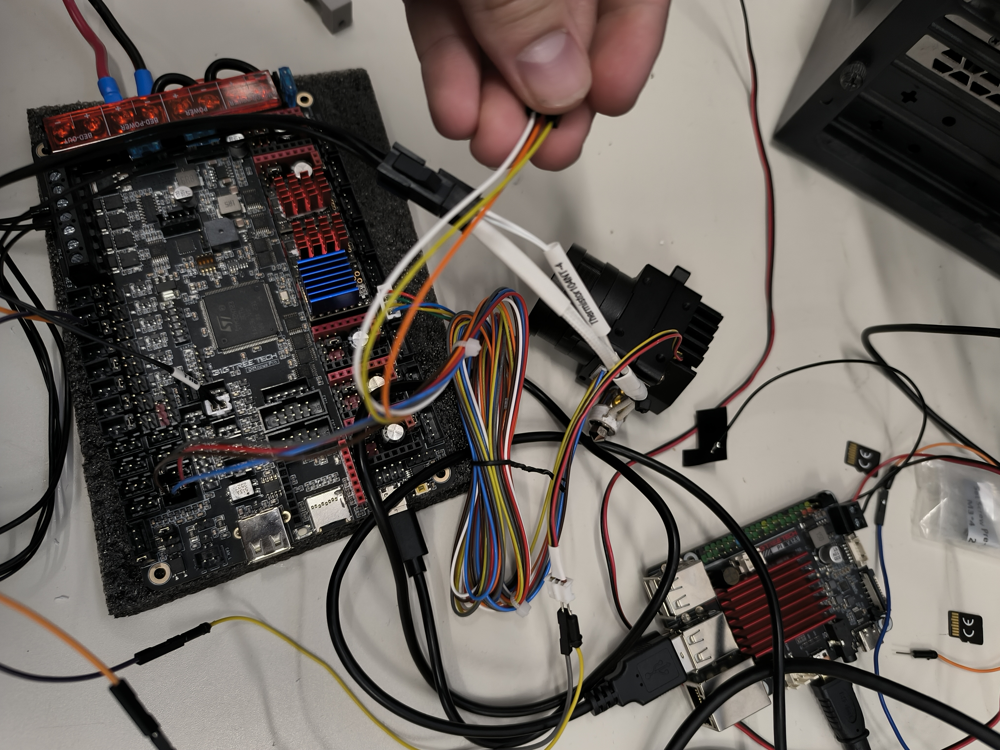

# Impresora 3D Cartesiana 1000×1000×1000 mm

> Proyecto de construcción de una impresora 3D cartesiana de gran formato desde cero.  
> Firmware: **Klipper** | Placa: **BTT Octopus Pro V1.1 (H723)** | Control: **BTT CB1**

---

## Especificaciones técnicas

| Parámetro | Valor |
|-----------|-------|
| **Volumen de impresión** | 1000 × 1000 × 1000 mm |
| **Cinemática** | Cartesiana (ejes X/Y/Z independientes) |
| **Firmware** | Klipper + Fluidd (interfaz web) |
| **Placa base** | BigTreeTech Octopus Pro V1.1 (STM32H723) |
| **Ordenador de control** | BigTreeTech CB1 (ARM Cortex-A55) |
| **Velocidad máxima** | 300 mm/s (XY), 5 mm/s (Z) |
| **Aceleración máxima** | 3000 mm/s² |
| **Extrusor** | Orbiter SO3 (relación 7.5:1) |
| **Motor extrusor** | LDO-36STH20-1004AHG |
| **Hotend** | Boquilla 0.4 mm, 24V 72W calentador cerámico |
| **Sensor Z** | CR Touch (Creality ALT04) |
| **Drivers XY/Extrusor** | TMC2209 (UART, StealthChop) |
| **Drivers Z** | TMC5160-T Pro (SPI, alta corriente) |
| **Motores XY** | NEMA 17 |
| **Motores Z** | NEMA 23 (2 unidades, dual Z) |
| **Guías lineales** | MGN15R |
| **Husillo Z** | Métrica 12, paso 2mm × 4 entradas = 8mm/rev |

---

## Fotos del proyecto

### Placa base — BTT Octopus Pro

*Vista general de la BTT Octopus Pro V1.1 con drivers TMC5160 (rojo) y TMC2209 (azul) instalados.*

### Cableado en progreso

*Conexión de motores, extrusor y sensores a la placa. A la derecha, la BTT CB1.*

### CR Touch — Sonda de nivelación

*CR Touch modelo ALT04 con su cable de 5 hilos de colores.*

### Estructura — Guía lineal MGN15R

*Guía lineal MGN15R con carro y piezas impresas en naranja para el eje.*

### Estructura — Husillo y perfil de aluminio

*Perfil de aluminio 2040, guía lineal y husillo roscado del eje Z.*

---

## Índice de documentación

### Hardware
- [Lista de componentes (BOM)](hardware/componentes.md) — qué compramos y por qué
- [Placa BTT Octopus Pro](hardware/placa-octopus-pro.md) — slots, drivers, jumpers, alimentación
- [Motores y drivers](hardware/motores-drivers.md) — NEMA17 vs NEMA23, TMC2209 vs TMC5160
- **Cableado por eje:**
  - [Eje X](hardware/cableado/eje-x.md)
  - [Eje Y — Dual motor en paralelo](hardware/cableado/eje-y.md)
  - [Eje Z — Dual Z independiente](hardware/cableado/eje-z.md)
  - [Extrusor — Orbiter SO3](hardware/cableado/extrusor.md)
  - [CR Touch — Sonda Z virtual](hardware/cableado/crtouch.md)
  - [Cama calefactada](hardware/cableado/cama.md)

### Firmware
- [Configuración Klipper (printer.cfg)](firmware/printer.cfg) — archivo de configuración completo
- [Instalación y flasheo de Klipper](firmware/klipper-setup.md)
- [Calibración](firmware/calibracion.md) — PID, Z offset, bed mesh, Z_TILT

### Problemas y soluciones
- [Índice de problemas](problemas/README.md) — todos los bugs encontrados y cómo los resolvimos
  - [Slot MOTOR 3 defectuoso](problemas/motor-z-slot-defectuoso.md)
  - [Motores Y en paralelo](problemas/eje-y-dual.md)
  - [Ventilador hotend no se apaga](problemas/ventilador-hotend.md)
  - [Endstop Z — Configuración correcta](problemas/endstop-z.md)
  - [CR Touch — z_offset obligatorio](problemas/crtouch-z-offset.md)
  - [Termistor cama sin instalar](problemas/termistor-cama.md)

### Diario del proyecto
- [Progreso cronológico](diario/progreso.md) — de 500×500mm a 1000×1000mm

---

## Historia del proyecto

Este proyecto empezó como una impresora de **500×500mm** (basada en una Ender 5 Plus modificada) y fue escalado a **1000×1000×1000mm** después de validar la electrónica y el firmware.

El mayor reto fue conseguir que el **doble eje Z con NEMA 23** funcionara correctamente. Los drivers TMC5160 son necesarios porque los NEMA 23 requieren 2A de corriente — más de lo que aguanta un TMC2209.

---

