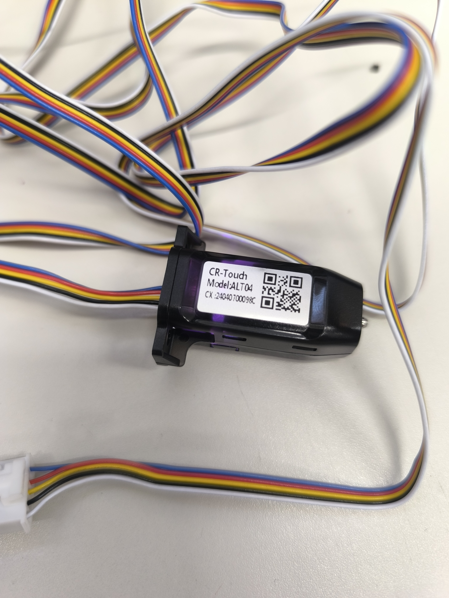
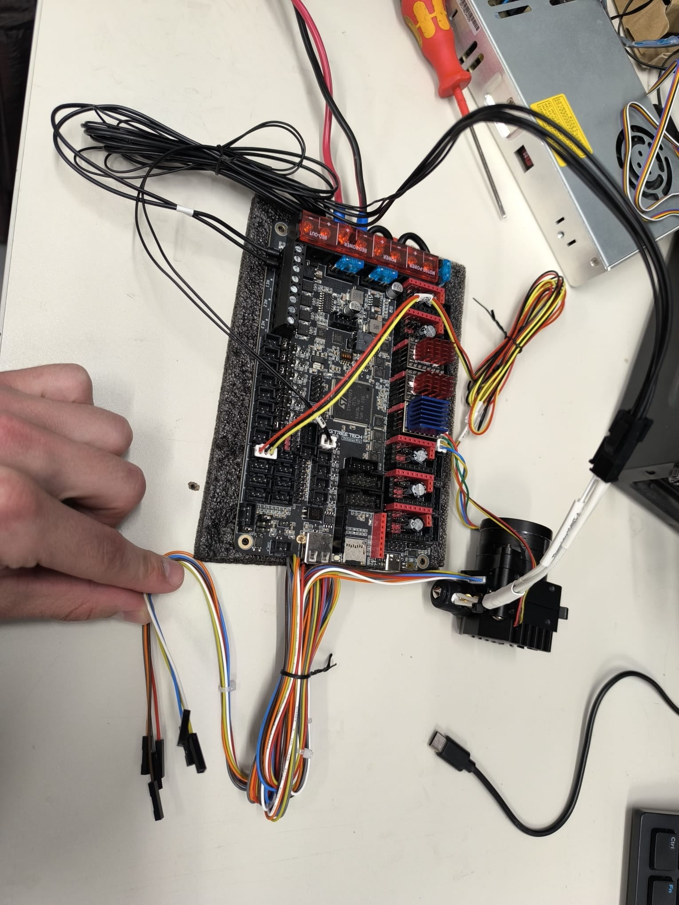
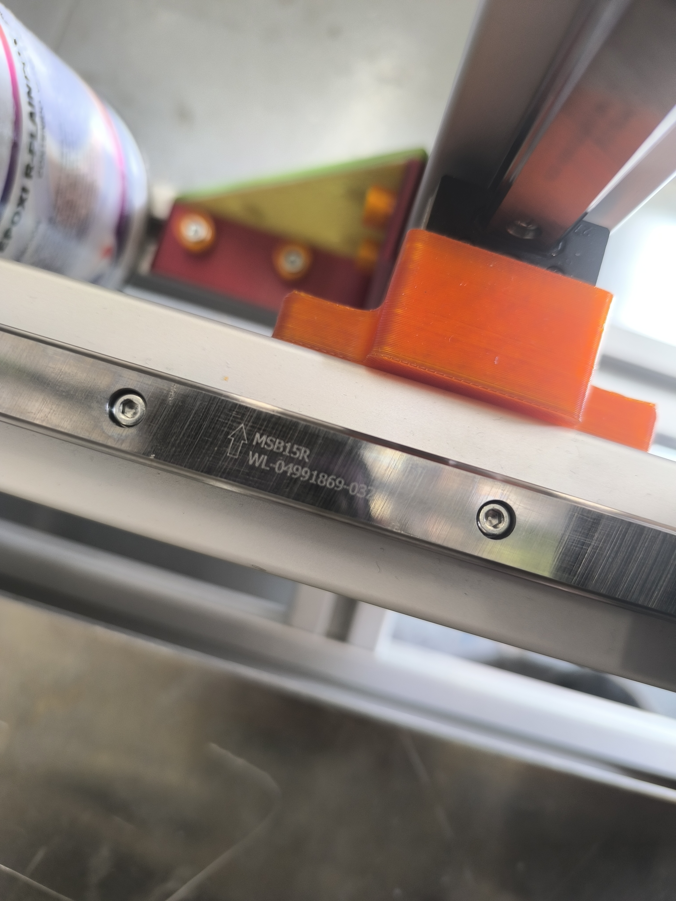
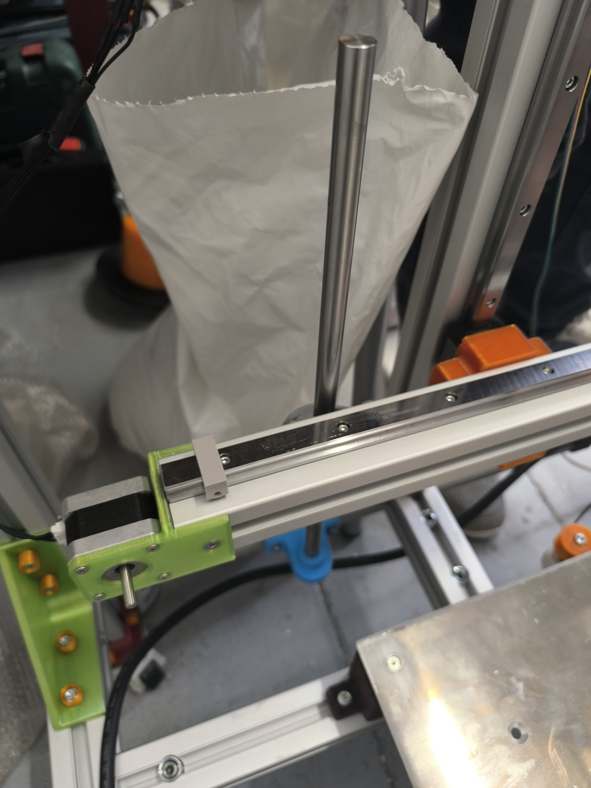
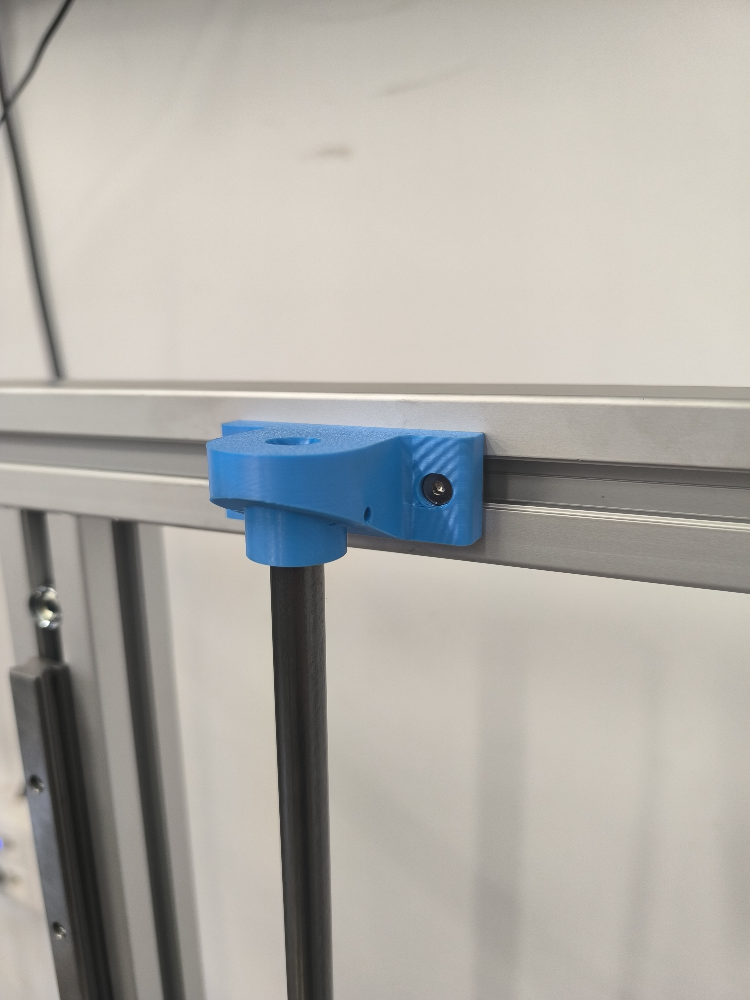
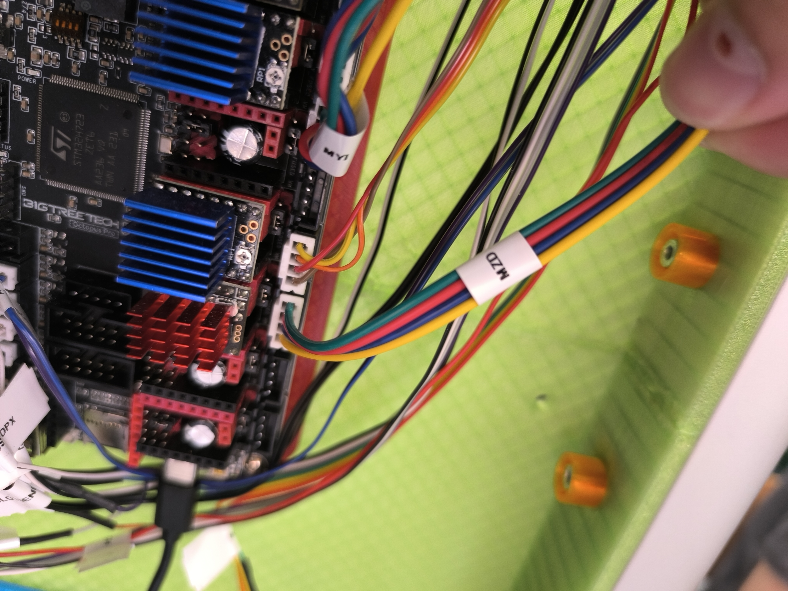
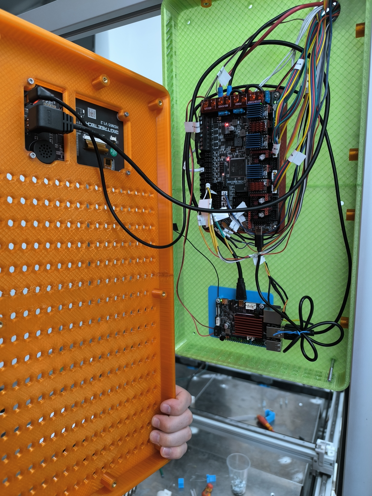
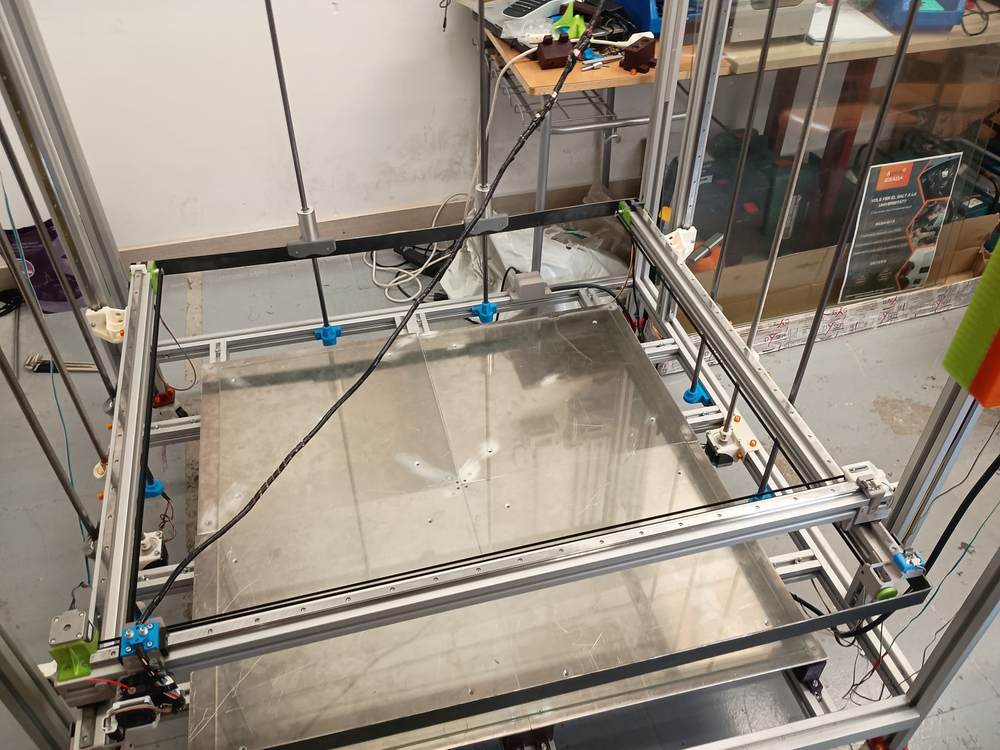

# Diario del proyecto

> Cronología completa: desde los primeros componentes en febrero hasta la impresora de 1m³ funcionando.

---

## Fase 0 — Recepción de componentes y primeras inspecciones (Febrero 2026)

### 25 de febrero — Llega la Octopus Pro

Recibimos la BTT Octopus Pro V1.1 y la inspeccionamos antes de conectar nada.

*Vista trasera de la placa recién recibida. Se pueden leer claramente todos los slots: MOTOR0, MOTOR1, MOTOR2_1, MOTOR2_2... hasta MOTOR7. Versión: 1.1.*

También inspeccionamos la zona del USB-C y el conector de la fuente de alimentación.

**Primer paso:** Identificar todos los slots de driver y planificar qué motor va en cada slot antes de conectar nada.

---

## Fase 1 — Montaje de la estructura (Febrero–Marzo 2026)

El primer paso real del proyecto fue cortar y montar el **marco de perfiles de aluminio item 40×80mm**.

### Materiales de la estructura
- Perfiles item 40×80mm cortados a medida (ver [lista de materiales](../hardware/lista-materiales-estructura.md))
- Conectores angulares metálicos para unir los perfiles en esquinas
- Tornillería M3 y M4 con tuercas T en ranura del perfil

### Piezas impresas para la estructura

Durante esta fase se imprimieron todas las piezas en 3D necesarias:

*Todas las piezas impresas listas en el aula: soportes de motor verdes y guías grises.*

*Soportes para los 4 motores NEMA 23 del eje Z.*

*Tensores de correa GT2 y soportes impresos.*

---

## Fase 2 — Primera electrónica: testeo de la placa (Abril 2026)

### 8 de abril — Primeras conexiones

Conectamos los primeros componentes a la Octopus Pro para probar que la placa funcionaba antes de montarla en la estructura.

*CR Touch modelo ALT04 con sus 5 cables de colores.*

*Cables del hotend identificados: termistor ATC Semitec 104NT-4 y calentador cerámico 24V 72W.*

*Vista general de la placa con drivers instalados: TMC5160 rojos (Z) y TMC2209 azules (X, Y, extrusor).*

### 10 de abril — Primer arranque con CR Touch

Conectamos el CR Touch a la placa y arrancamos Klipper por primera vez.

*Placa conectada a la fuente de alimentación y al CR Touch para el primer test.*

**Problema encontrado:** Klipper no arrancaba porque faltaba `z_offset: 0` en la sección `[bltouch]`.  
→ Ver [crtouch-z-offset.md](../problemas/crtouch-z-offset.md)

### 10 de abril — Test de motores

*Conectando los cables del CR Touch a los pines PB6 y PB7 de la Octopus Pro.*

---

## Fase 3 — Problemas de hardware (Abril 2026)

### Slot MOTOR 3 defectuoso

Descubrimos que el slot MOTOR 3 de la placa estaba **defectuoso de fábrica**. El motor Z derecho no respondía.

**Diagnóstico:** Probamos el driver en otros slots — funcionaba. Probamos el motor en otros slots — funcionaba. El slot MOTOR 3 estaba muerto.

**Solución:** Mover el motor Z derecho al slot **MOTOR 5** y actualizar `printer.cfg`.

→ Ver [motor-z-slot-defectuoso.md](../problemas/motor-z-slot-defectuoso.md)

### Motor Y no se movía

El motor Y no respondía. Diagnóstico rápido: **el cable JST no estaba bien conectado**.

**Lección:** Antes de cambiar configuración, revisar siempre el cable físico.

→ Ver [eje-y-dual.md](../problemas/eje-y-dual.md)

---

## Fase 4 — Cableado completo (23 de abril 2026)

*Sesión de cableado: todos los motores, sensores y calefactores conectados a la placa.*

*Setup de trabajo: Octopus Pro + CB1 + teclado + pantalla con Fluidd. La tablet naranja es la pantalla KlipperScreen.*

### Problemas de ventilación

El ventilador del heatsink del SO3 no se apagaba nunca. La causa: estaba configurado como `[fan]` (ventilador de capa) en lugar de `[heater_fan]`.

→ Ver [ventilador-hotend.md](../problemas/ventilador-hotend.md)

---

## Fase 5 — Primer arranque de Klipper

*Primer arranque con errores de configuración. Fluidd muestra los avisos de printer.cfg que hay que corregir antes de poder mover nada. La tablet naranja (KlipperScreen) ya está activa.*

*¡Klipper funcionando! Fluidd mostrando la interfaz completa en el monitor Dell. A la izquierda el rack de electrónica con todo conectado.*

*Setup de desarrollo completo: monitor Dell con Fluidd, KlipperScreen naranja en la mesa y toda la electrónica montada a la izquierda.*

En el monitor se ve la interfaz de Fluidd con:
- Temperatura del hotend y la cama
- Controles de movimiento XYZ
- Consola para comandos G-code
- Estado de la impresora

La tablet naranja en la mesa es la **BTT KlipperScreen** — pantalla táctil para controlar la impresora sin necesidad de un PC.

---

## Fase 6 — Montaje en la estructura (Mayo 2026)

### 22 de abril — Guías lineales y carro

Instalamos las guías lineales MGN15R en el eje Y:

*Guía MGN15R con carro instalada en el perfil item 40×80mm.*

*Soporte de motor impreso (verde) montado sobre el perfil item 40×80mm. La polea loca naranja guía la correa GT2. En la parte superior se ven los tensores impresos también en naranja.*

### 13 de mayo — Husillo y eje Z

Instalamos los husillos trapezoidales M12 de 1200mm con sus soportes impresos:

*Husillo M12 (4 entradas, 8mm/vuelta) instalado en el perfil vertical del eje Z.*

*Soporte impreso en azul para el extremo superior del husillo.*

---

## Fase 7 — Integración final del cabezal

*Mazo de cables del cabezal ya instalado en la impresora. Los cables están etiquetados como "EXTRUSOR" para facilitar el mantenimiento.*

---

## Fase 8 — Cableado completo y etiquetado (1 junio 2026)

### 1 de junio — Sesión de cableado final

Sesión completa de conexión de todos los cables al panel de electrónica verde. Se etiquetaron todos los conectores antes de enchufar.

**Sistema de etiquetado de cables:**

| Etiqueta | Cable |
|----------|-------|
| `MY1` | Motor Y izquierdo (MOTOR2_1) |
| `MY2` | Motor Y derecho (MOTOR2_2, paralelo) |
| `MX` | Motor X (MOTOR0) |
| `MZ1` | Motor Z izquierdo (MOTOR1) |
| `MZ2` | Motor Z derecho (MOTOR5) |
| `BLTOU` | Cable de control CR Touch (servo, PB6) |
| `NDSTOPZ` | Endstop Z máximo (PF7) |
| `NDSTOPX` | Endstop X (PG6) |
| `BED` | Cables cama calefactada (pendiente) |

*Panel verde con Octopus Pro + CB1 completamente cableado. Todos los conectores llevan etiquetas impresas.*

*Detalle de los drivers con cables etiquetados saliendo hacia los motores.*

*La pantalla KlipperScreen (carcasa naranja impresa en 3D) instalada junto al panel de electrónica en la máquina.*

### Incidente — Cable de endstop roto

Durante el proceso de etiquetado se encontró un cable de endstop con el extremo pelado (sin terminal). Se resoldó y se crimpó un terminal nuevo.

**Lección**: siempre revisar la continuidad de los cables de endstop antes de energizar.

---

## Fase 9 — Máquina completamente ensamblada (5 junio 2026)

La impresora está **de pie y operativa** en el taller del Institut Jaume Huguet. Esta es la primera vez que la máquina se ve completamente montada en su ubicación final.

### Estado del montaje

*Impresora 3D de 1000×1000×1000mm completamente ensamblada en el taller. Altura total aproximada 1.5m. KlipperScreen (naranja) montado en el perfil lateral derecho.*

*Vista interior desde arriba: cama de cristal provisional instalada sobre el marco inferior. Los cables del eje X recorren la estructura.*

*Carro del eje Y con el endstop (azul) montado y el cabezal de impresión en posición.*

*La impresora en el contexto del aula-taller. La escala respecto al mobiliario del instituto muestra el tamaño real de la máquina.*

### Componentes montados en esta fase
- ✅ Marco item 40×80mm completamente ensamblado
- ✅ Guías lineales MGN15R instaladas en X, Y, Z
- ✅ Motores NEMA17 (X, Y×2) y NEMA23 (Z×2) montados
- ✅ Husillos M12 instalados y acoplados
- ✅ Panel de electrónica (Octopus Pro + CB1) instalado
- ✅ KlipperScreen montado en perfil lateral
- ✅ Cama de cristal provisional (para primeras pruebas)
- ✅ Patas niveladoras instaladas
- ⏳ Cama calefactada (4 × 500×500mm) — pendiente instalar

---

## Estado actual

| Sistema | Estado |
|---------|--------|
| Marco estructura | ✅ Montado |
| Guías lineales MGN15R | ✅ Instaladas |
| Eje X | ✅ Funcionando |
| Eje Y dual (2 motores paralelo) | ✅ Funcionando |
| Eje Z dual (TMC5160 + NEMA23) | ✅ Funcionando |
| Extrusor SO3 | ✅ Funcionando |
| CR Touch + Bed Mesh 5×5 | ✅ Configurado |
| Z_TILT_ADJUST | ✅ Configurado |
| Klipper + Fluidd + KlipperScreen | ✅ Funcionando |
| Cama calefactada (4×500×500mm) | ⏳ Pendiente instalar |
| Archivos 3D de piezas | ⏳ Pendiente subir (Sergio) |

---

## Pendientes

- [ ] Instalar termistor en cama calefactada
- [ ] Instalar 4 × camas calefactadas 500×500mm en paralelo
- [ ] Subir archivos STL/STEP de piezas impresas (Sergio)
- [ ] Completar calibración final (PID cama, Z offset definitivo con `PROBE_CALIBRATE`)
- [ ] Subir planos del marco en PDF (Sergio)
- [ ] Añadir ventiladores en panel de electrónica
