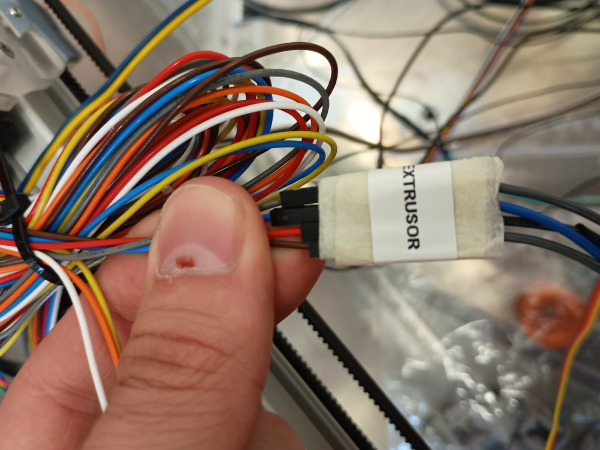

# Cableado — LDO Smart Orbiter v3.0

> El extrusor es el componente más complejo del cabezal: motor, hotend, termistor, calentador, ventilador, sensor de filamento y botón de descarga.

---

## Cables del cabezal instalados en la impresora


*Mazo de cables del cabezal con etiqueta "EXTRUSOR" ya instalado en la impresora. El mazo incluye: motor, termistor, calentador, ventilador, sensor de filamento, botón y CR Touch.*


*Detalle del extremo del conector: etiquetas "Thermistor104NT-4" y "24V/72W Heater" para identificar cada cable sin errores.*

---

## Componentes del cabezal

| Componente | Especificación |
|-----------|----------------|
| Extrusor | LDO Smart Orbiter v3.0 (direct drive, reducción 7.5:1) |
| Motor | LDO-36STH20-1004AHG (compacto, 1A nominal) |
| Driver | TMC2209 (UART), slot MOTOR 4 |
| Termistor | ATC Semitec 104NT-4-R025H42G |
| Calentador | 24V, 72W cerámico |
| Ventilador heatsink | Frameless 24V (integrado en SO3) |
| Sensor filamento | Integrado en SO3 (switch) |
| Botón descarga | Integrado en SO3 |

---

## Motor y driver

```ini
[extruder]
step_pin: PF9
dir_pin: PF10
enable_pin: !PG2
microsteps: 16
full_steps_per_rotation: 200
rotation_distance: 4.637   # calibrado (oficial SO3: 4.69)
nozzle_diameter: 0.400
filament_diameter: 1.750
max_extrude_only_distance: 500
max_extrude_only_velocity: 120

[tmc2209 extruder]
uart_pin: PF2
run_current: 0.850
hold_current: 0.100
stealthchop_threshold: 0   # StealthChop DESACTIVADO — máxima respuesta
```

### Por qué StealthChop desactivado en el extrusor

StealthChop hace el motor silencioso pero introduce latencia en los cambios de velocidad. Para el extrusor necesitamos **máxima respuesta** en las aceleraciones y deceleraciones de filamento. El ruido extra del extrusor es aceptable.

### Calibración de rotation_distance

El SO3 tiene una relación de reducción de 7.5:1. El valor oficial es `4.69`, pero fue necesario calibrarlo:

```bash
# Procedimiento de calibración:
# 1. Marcar el filamento a 100mm de la entrada
# 2. Enviar comando de extrusión: G1 E100 F100
# 3. Medir cuánto filamento entró realmente (por ej: 98.7mm)
# 4. rotation_distance_nuevo = rotation_distance_actual × (medido / pedido)
# 4.69 × (98.7 / 100) = 4.637
```

---

## Hotend

```ini
heater_pin: PA3            # HE0 — calentador cerámico 24V 72W
sensor_type: ATC Semitec 104NT-4-R025H42G
sensor_pin: PF4            # T0 — termistor
min_temp: 0
max_temp: 300
min_extrude_temp: 170      # protección: no extruye frío

# PID calibrado (resultado de PID_CALIBRATE HEATER=extruder TARGET=220)
control = pid
pid_kp = 22.602
pid_ki = 1.408
pid_kd = 90.690
```

El bloque PID quedó guardado automáticamente en `#*# SAVE_CONFIG` tras ejecutar:
```
PID_CALIBRATE HEATER=extruder TARGET=220
SAVE_CONFIG
```

---

## Ventilador heatsink

El SO3 tiene un ventilador frameless integrado. **Solo tiene 2 pines** (VCC y GND), sin señal PWM.

```ini
[heater_fan hotend_fan]
pin: PD12              # FAN2 de la Octopus Pro
heater: extruder
heater_temp: 50.0      # se activa cuando hotend > 50°C
fan_speed: 1.0         # siempre a máxima velocidad cuando activo
```

**Cableado del ventilador frameless:**
```
Ventilador SO3 (2 cables):
  Rojo  → VCC FAN2 en Octopus
  Negro → GND FAN2 en Octopus
  (El tercer cable amarillo de señal PWM no se conecta)
```

> Los conectores FAN de la Octopus Pro tienen 3 pines (VCC, GND, señal). Para ventiladores de 2 hilos, solo conectar VCC y GND.

---

## Sensor de filamento

```ini
[filament_switch_sensor sensor_filamento]
switch_pin: ^PG11
pause_on_runout: True
runout_gcode:
  M118 Filamento agotado - pausando impresion
```

Cuando el filamento se agota, el sensor abre el circuito → Klipper pausa la impresión automáticamente.

## Botón de descarga

```ini
[gcode_button boton_descarga]
pin: ^!PG10            # ^! = pullup + lógica invertida (normalmente cerrado)
press_gcode:           # (vacío)
release_gcode:
  M118 Boton descarga pulsado
  filament_unload_init
```

Al soltar el botón físico (no al pulsar), ejecuta la macro de descarga:

```ini
[gcode_macro filament_unload_init]
gcode:
  
    M109 S185          # calentar a 185°C
    G92 E0
    G1 E-5 F3000       # retracción rápida 5mm
    G1 E-25 F300       # retracción lenta 25mm
    M104 S0            # apagar calefactor
  
    M118 No se puede descargar mientras se imprime!
  
```
