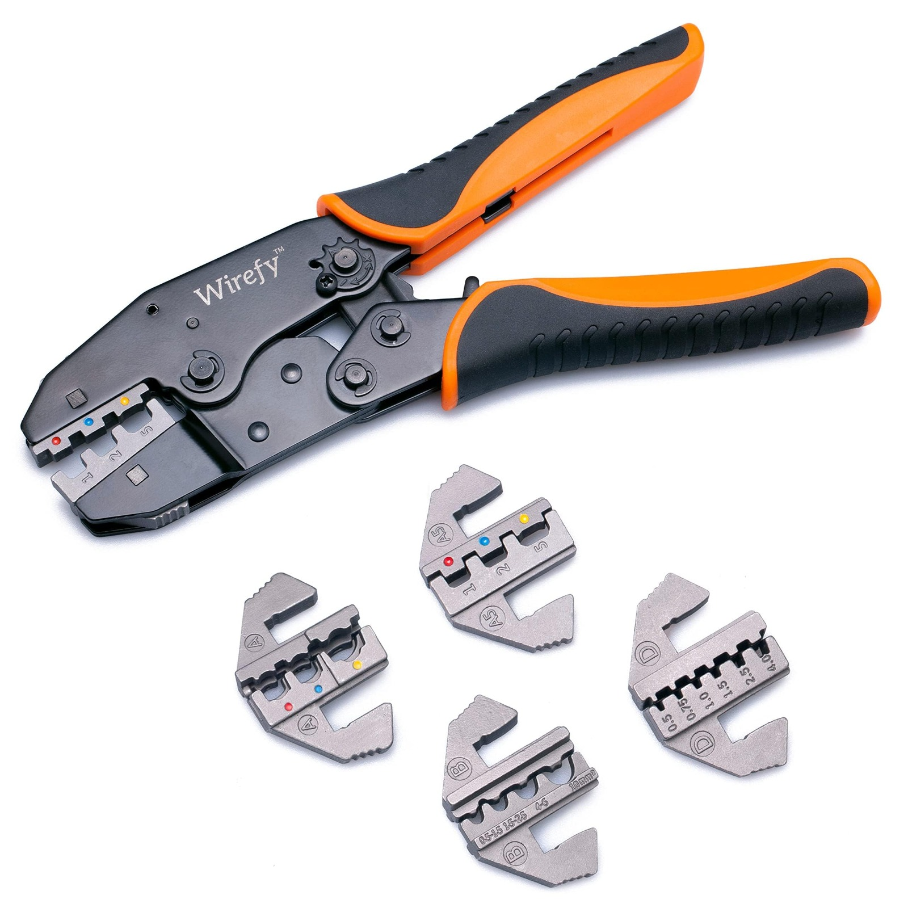

# Cableado — Vista general

> Mapa de conexiones de todos los sistemas a la BTT Octopus Pro V1.1.

---

## Diagrama de sistemas

```mermaid
graph TD
    PSU[Fuente de alimentación 24V] --> OCT[BTT Octopus Pro V1.1]
    CB1[BTT CB1 ARM] <-->|USB-C| OCT

    OCT -->|MOTOR 0 - UART| X[Motor X - NEMA17]
    OCT -->|MOTOR 2_1 - UART| Y1[Motor Y izq - NEMA17]
    OCT -->|MOTOR 2_2 paralelo| Y2[Motor Y der - NEMA17]
    OCT -->|MOTOR 1 - SPI| Z1[Motor Z izq - NEMA23]
    OCT -->|MOTOR 5 - SPI| Z2[Motor Z der - NEMA23]
    OCT -->|MOTOR 4 - UART| EXT[Extrusor SO3 - LDO]

    OCT -->|PG6 endstop| ES_X[Endstop X]
    OCT -->|PG9 endstop| ES_Y[Endstop Y]
    OCT -->|PF7 T3| ES_ZMAX[Endstop Z máximo]
    OCT -->|PB6 control / PB7 sensor| CRT[CR Touch ALT04]

    OCT -->|PF4 T0| THERM_E[Termistor extrusor]
    OCT -->|PF3 T1| THERM_B[Termistor cama pendiente]
    OCT -->|PA3 HE0| HEAT_E[Calentador hotend 24V 72W]
    OCT -->|PA1 HE_BED| HEAT_B[Calentador cama]

    OCT -->|PD12 FAN2| FAN_HS[Ventilador heatsink SO3]
    OCT -->|PG11 endstop| FIL[Sensor filamento SO3]
    OCT -->|PG10 gcode_button| BTN[Botón descarga SO3]
```



---

## Mapa de slots usados

| Slot físico | Componente | Driver | Pin step | Pin dir | Pin enable |
|-------------|-----------|--------|----------|---------|------------|
| MOTOR 0 | Motor X | TMC2209 | PF13 | PF12 | !PF14 |
| MOTOR 1 | Motor Z izq | TMC5160 | PG0 | PG1 | !PF15 |
| MOTOR 2_1 | Motor Y (×2 paralelo) | TMC2209 | PF11 | PG3 | !PG5 |
| MOTOR 2_2 | Motor Y derecho (paralelo) | — | — | — | — |
| MOTOR 3 | **DEFECTUOSO** — no usar | — | — | — | — |
| MOTOR 4 | Extrusor SO3 | TMC2209 | PF9 | PF10 | !PG2 |
| MOTOR 5 | Motor Z der | TMC5160 | PC13 | !PF0 | !PF1 |

> El `!` en dir_pin = inversión de dirección (el motor giraría al revés sin él).

---

## Pines de endstop

| Componente | Pin | Modo | Conector en placa |
|-----------|-----|------|-------------------|
| Endstop X | PG6 | Digital, pullup | STOP_0 |
| Endstop Y | PG9 | Digital, pullup | STOP_2 |
| Endstop Z virtual | probe:z_virtual_endstop | CR Touch | (via bltouch) |
| Endstop Z máximo | PF7 | Digital, pullup | T3 |

---

## Pines de temperatura

| Componente | Pin | Tipo | Conector |
|-----------|-----|------|---------|
| Termistor extrusor | PF4 | ATC Semitec 104NT-4-R025H42G | T0 (J45) |
| Termistor cama | PF3 | EPCOS 100K (placeholder) | T1 (J44) |

---

## Pines de calefacción

| Componente | Pin | Especificación |
|-----------|-----|----------------|
| Hotend | PA3 | 24V, 72W cerámico |
| Cama | PA1 | 24V (potencia variable) |

---

## Pines de ventilador

| Ventilador | Pin | Tipo en Klipper |
|-----------|-----|-----------------|
| Heatsink SO3 | PD12 (FAN2) | `[heater_fan]` — controlado por temp hotend |

---

## CR Touch — Pinout completo

| Cable | Color | Función | Pin Octopus |
|-------|-------|---------|-------------|
| 1 | Azul | Sensor / señal touch | PB7 |
| 2 | Rojo | GND | GND |
| 3 | Amarillo | Control (servo) | PB6 |
| 4 | Negro | 5V | 5V |
| 5 | Blanco | GND | GND |

---

## Alimentación

La Octopus Pro tiene tres entradas de alimentación independientes:

```
MOTOR-POWER   → 24V — alimenta los drivers (1-8 todos)
POWER         → 24V — alimenta la lógica, ventiladores, hotend
BED-POWER     → 24V — alimenta exclusivamente la cama calefactada
BED-OUT       → salida hacia la cama
```

> Separar BED-POWER del resto es importante: la cama consume mucha corriente y puede causar ruido en la señal de los motores si comparte rail con ellos.

**Configuración actual:** las tres entradas están puenteadas para usar una sola fuente 24V.  
**Futuro:** separar BED-POWER para conectar un relé de alta potencia (4 camas 500×500mm en paralelo).

---

## Crimpado de cables

Todos los conectores JST del proyecto están crimpados a mano con la herramienta apropiada.


*Herramienta crimpadora Wirefy con juego de matrices intercambiables. Cada matriz corresponde a un tamaño de terminal: 0.5mm², 1mm², 1.5mm², 2.5mm². Los cables se cortan a la longitud necesaria y se crimpa el terminal antes de insertar en la carcasa JST.*
