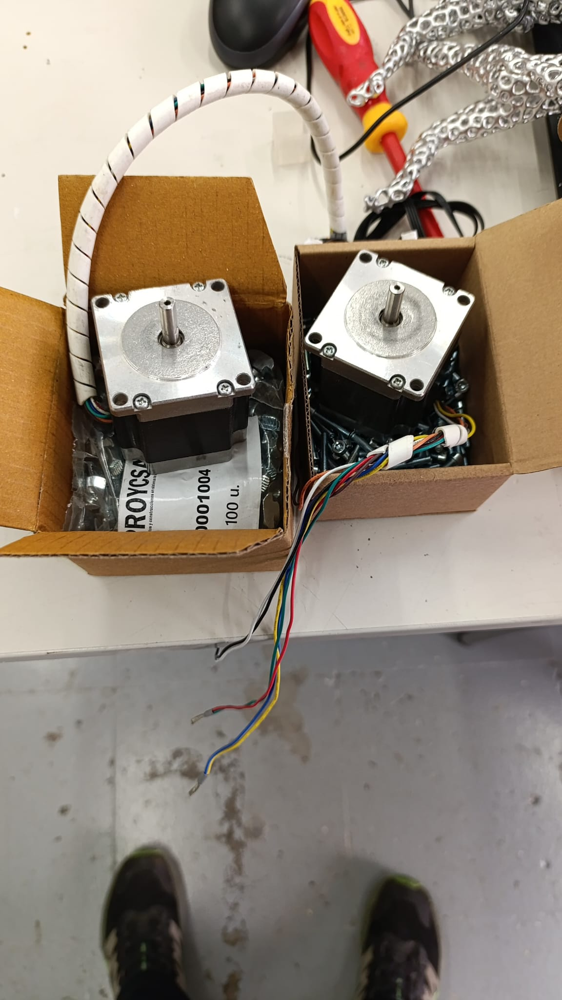

# Lista de materiales — Estructura mecánica

> **Nota:** Esta lista está basada en los planos del proyecto. Para medidas exactas de los perfiles de aluminio consultar el PDF de planos estructurales adjunto.

---

## Perfiles de aluminio 2040 (20×40mm)

| Pieza | Cantidad | Longitud aproximada | Eje |
|-------|----------|---------------------|-----|
| Perfil horizontal frontal/trasero | 4 | ~1050mm | Y |
| Perfil horizontal izquierdo/derecho | 4 | ~1050mm | X |
| Perfil vertical (columnas) | 4 | ~1100mm | Z |
| Perfil intermedio refuerzo | ~4-8 | variable | — |

> Las longitudes exactas dependen del diseño final. Ver planos PDF del proyecto.

---

## Guías lineales MGN15R

| Eje | Cantidad | Longitud |
|-----|----------|---------|
| X | 1 | ~1050mm |
| Y | 2 | ~1050mm |
| Z (vertical) | 2 | ~1100mm |

Carros incluidos con cada guía: tipo R (rodamientos de bolas recirculantes).

---

## Husillos trapezoidales (Eje Z)

| Especificación | Valor |
|----------------|-------|
| Diámetro | M12 (métrica 12) |
| Paso | 2mm |
| Entradas | 4 (paso efectivo = 8mm/vuelta) |
| Longitud | ≥1200mm |
| Cantidad | 2 (uno por motor Z) |

---

## Motores paso a paso

| Motor | Cantidad | Eje | Modelo |
|-------|----------|-----|--------|
| NEMA 17 | 3 | X (×1) + Y (×2) | Estándar 42mm |
| NEMA 23 | 2 | Z izq + Z der | 57mm, ≥2A |
| LDO-36STH20 (integrado SO3) | 1 | Extrusor | LDO especial |

*Motores NEMA llegando en caja con tornillería incluida.*

---

## Correas y poleas (ejes X e Y)

| Componente | Especificación | Cantidad |
|-----------|----------------|----------|
| Correa GT2 | 2mm paso, 6mm ancho | ~4m total (2m por eje) |
| Polea GT2 motriz | 20 dientes, eje 5mm | 3 (X + 2×Y) |
| Tensor / polea loca | GT2 sin dientes | ×4-6 |

---

## Tornillería

> Lista aproximada. Ver PDF de planos para cantidades exactas.

| Tornillo | Cantidad |
|---------|----------|
| M3×8 cabeza cilíndrica | ~100 |
| M3×12 | ~50 |
| M5×8 (para perfiles 2040) | ~80 |
| M5×12 | ~40 |
| Tuercas T M5 (para ranura 2040) | ~100 |
| M3 insert (para piezas impresas) | ~60 |

---

## Electrónica

| Componente | Cantidad | Observación |
|-----------|----------|-------------|
| BTT Octopus Pro V1.1 (H723) | 1 | Placa principal |
| BTT CB1 | 1 | Ordenador de control |
| TMC2209 (azul) | 3 | Drivers X, Y, extrusor |
| TMC5160-T Pro (rojo) | 2 | Drivers Z izq + Z der |
| Fuente de alimentación 24V | 1 | ≥15A recomendado |
| Cama calefactada 1000×1000mm | 1 | 24V |
| CR Touch ALT04 | 1 | Sonda nivelación |
| Final de carrera mecánico | 3 | X, Y, Z_max |

---

## Piezas impresas en 3D

Ver [hardware/piezas-impresas.md](piezas-impresas.md) para el catálogo completo.

| Tipo | Color | Cantidad aproximada |
|------|-------|---------------------|
| Soportes motor NEMA 23 | Verde | 4 |
| Juntas cruzadas perfil | Verde | 8-12 |
| Tensores correa GT2 | Verde | 4-6 |
| Guías husillo (grises) | Gris | 4 |
| Portacables | Gris | ~20 |
| Soporte endstop | Gris | 3 |

---

## Planos estructurales

> Archivo PDF del proyecto (planos del marco, medidas de corte de perfiles, posicionamiento de componentes):

📎 [BTT_Octopus_pro_EN.pdf](../BTT_Octopus_pro_EN.pdf) — Manual de la placa base

> **Pendiente**: Subir el PDF de planos estructurales del marco de aluminio (elaborado por el equipo del proyecto).
