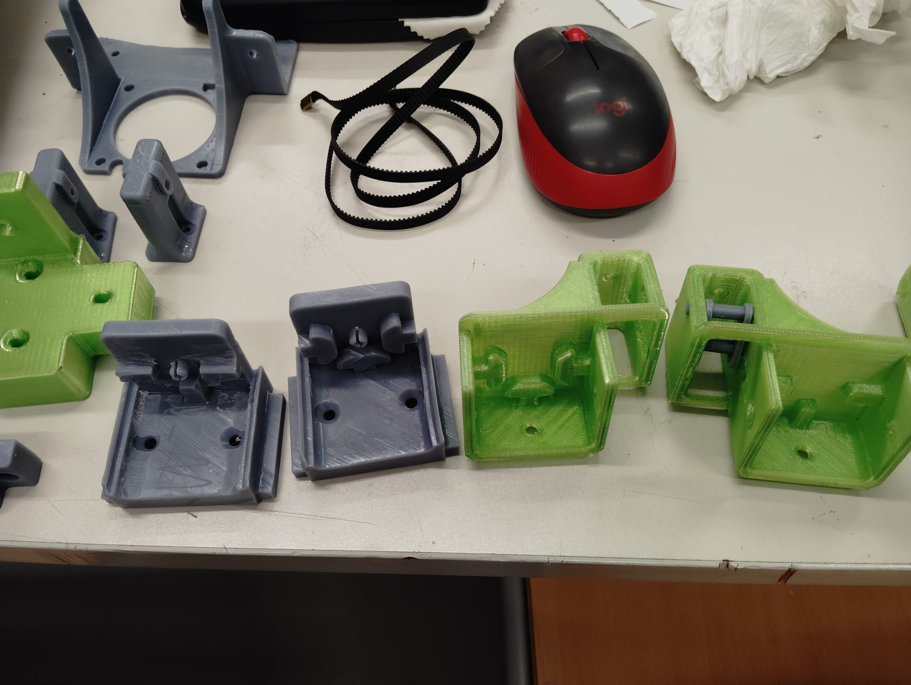

# Piezas impresas en 3D

> Todos los soportes y piezas mecánicas de la impresora están impresos en 3D. Esto permite adaptar cada pieza exactamente al diseño sin depender de piezas comerciales difíciles de encontrar.

---

## Materiales de impresión

| Material | Color | Uso |
|---------|-------|-----|
| PETG | Verde | Piezas estructurales no críticas (escuadras, soportes, protectores de barra, topes) |
| ASA / ABS | Gris | Piezas críticas que requieren mayor resistencia (guías de husillo, portacables funcionales) |

---

## Catálogo de piezas

### Soportes de motor NEMA 23 — ×4

Grandes soportes verdes que alojan los motores NEMA 23 de los ejes X e Y. Tienen espacio para el motor, el acoplador y la correa GT2.

*Cuatro soportes para los motores NEMA 23 de los ejes X e Y.*

---

### Juntas cruzadas / uniones de perfil (Cross joints)

Piezas en cruz verdes que unen los perfiles de aluminio 2040 en las esquinas y centros del marco. También actúan como sujeción para los ejes de los motores.

*Juntas cruzadas + soporte motor + soportes de correa GT2.*

*Tensores de correa GT2 y soportes de motor sobre la mesa.*

---

### Guías y soportes de husillo (grises)

Piezas grises que sujetan el husillo trapezoidal M12 y lo mantienen alineado con el marco.

*Sujetadores de husillo, engranajes de calibración y soporte de endstop.*

---

### Soportes de motor para el eje correa (tensores)

Piezas verdes con ranuras para ajustar la tensión de la correa GT2 de los ejes X e Y.

*Soporte de motor con polea metálica montado sobre el perfil de aluminio.*

---

### Portacables y organizadores

Piezas grises pequeñas que guían los cables por el marco y los mantienen ordenados.

---

## Todas las piezas en el aula

*Vista completa de todas las piezas impresas antes del montaje. Las verdes son estructurales, las grises son auxiliares.*

*Vista más amplia: toda la gama de piezas extendida en la mesa del aula — juntas cruzadas, soportes de motor, portacables y guías.*

*Los cuatro soportes de motor NEMA 23 (verde) alineados. El diseño en U permite alojar el motor, el acoplador y la parte superior del husillo.*

*Juntas cruzadas verdes (unión de perfiles), portacables grises y soporte de motor con tensores. Al fondo se ve la correa GT2.*

*Piezas auxiliares grises: portacables, engranajes de calibración y soporte de sensor de filamento montado.*

*Tensores de correa GT2 (verde), soporte de endstop (gris), y la correa GT2 de 6mm de paso 2mm. También se ven los soportes de ventilador y el carril guía.*

---

## Render del extrusor

*Renderizado 3D del mecanismo del extrusor mostrando la transmisión interna: rueda dentada, polea GT2 y el cuerpo de reducción.*

---

## Archivos 3D

> **Pendiente**: Subir los archivos fuente de los modelos 3D (.stl / .step) al repositorio.  
> Los modelos están diseñados específicamente para esta impresora. Contactar con el equipo del proyecto para obtener los archivos.
