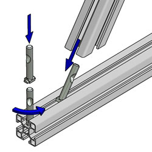
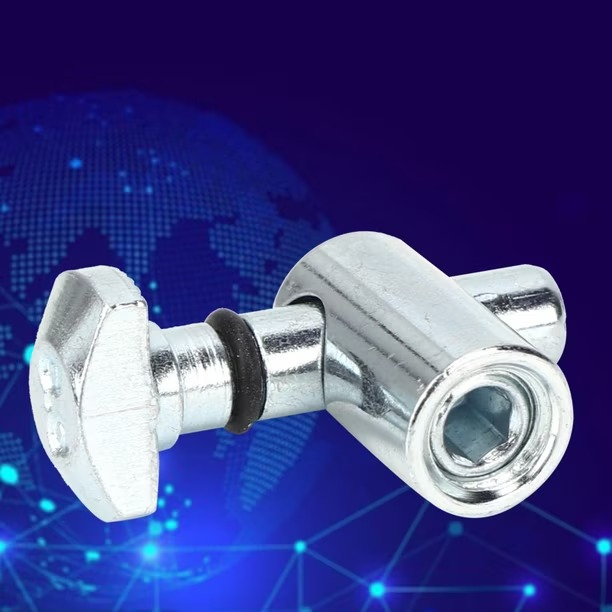
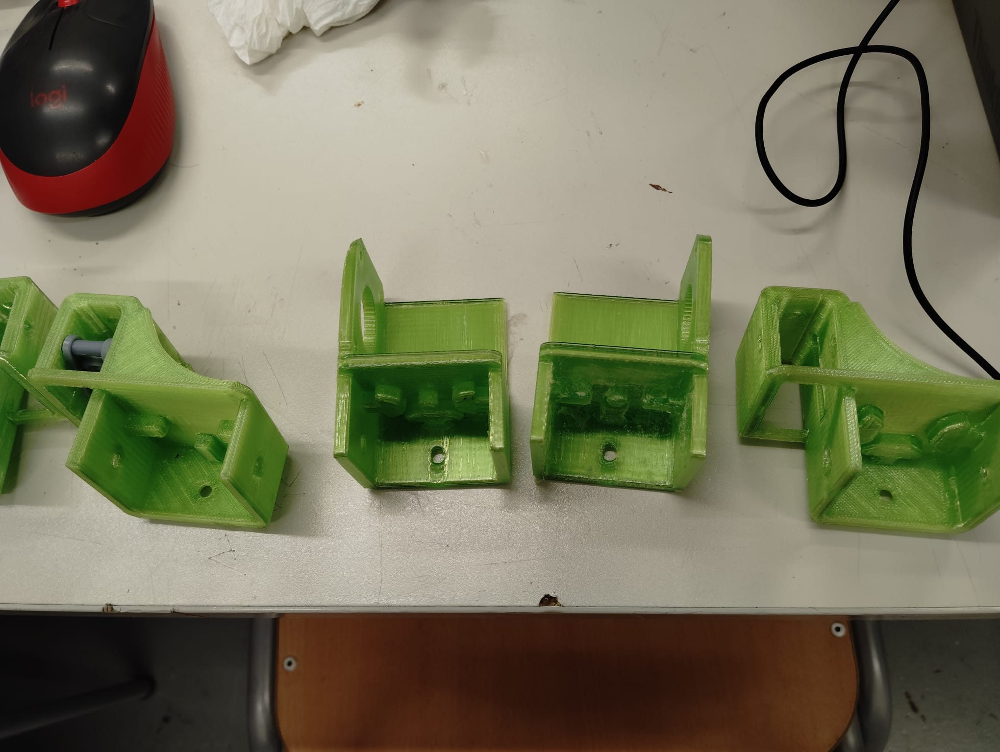
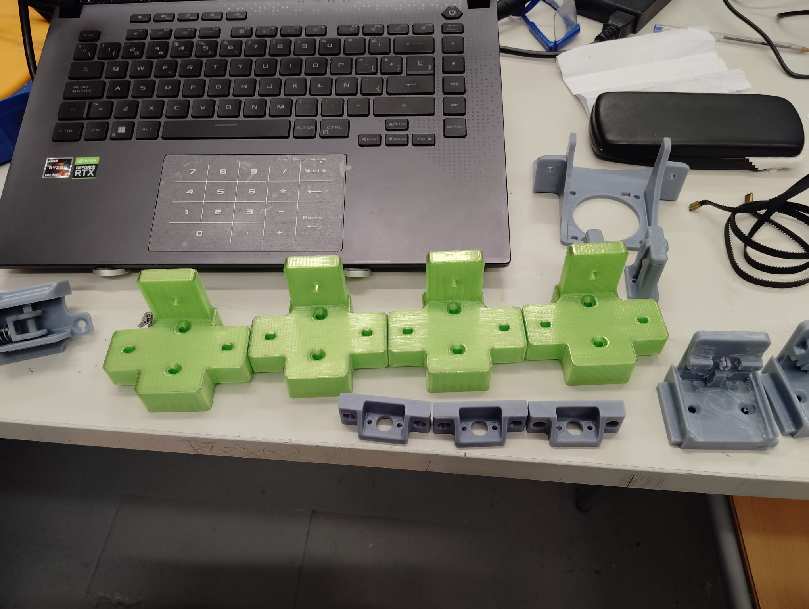
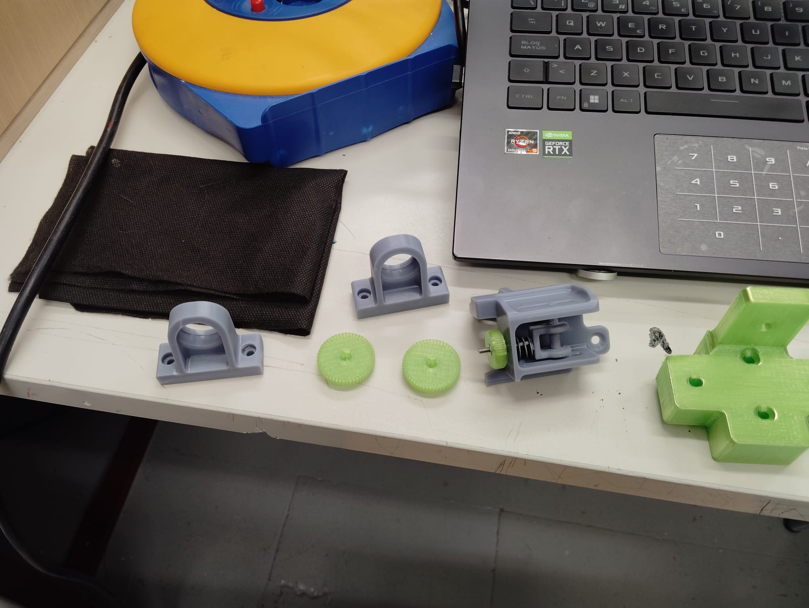
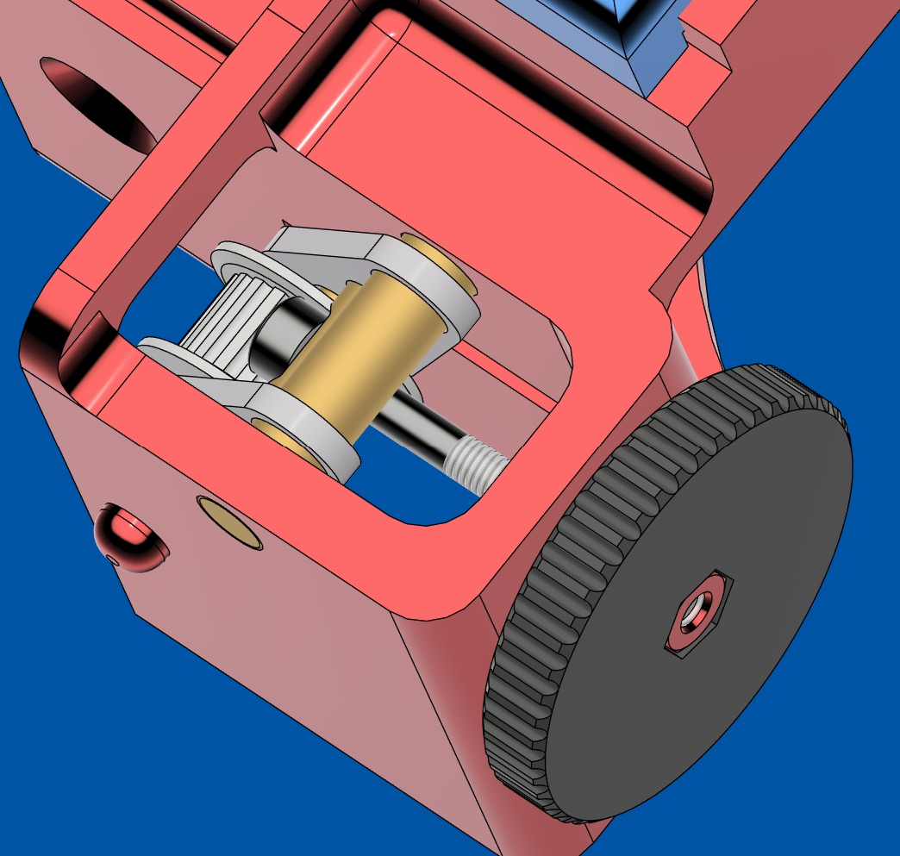
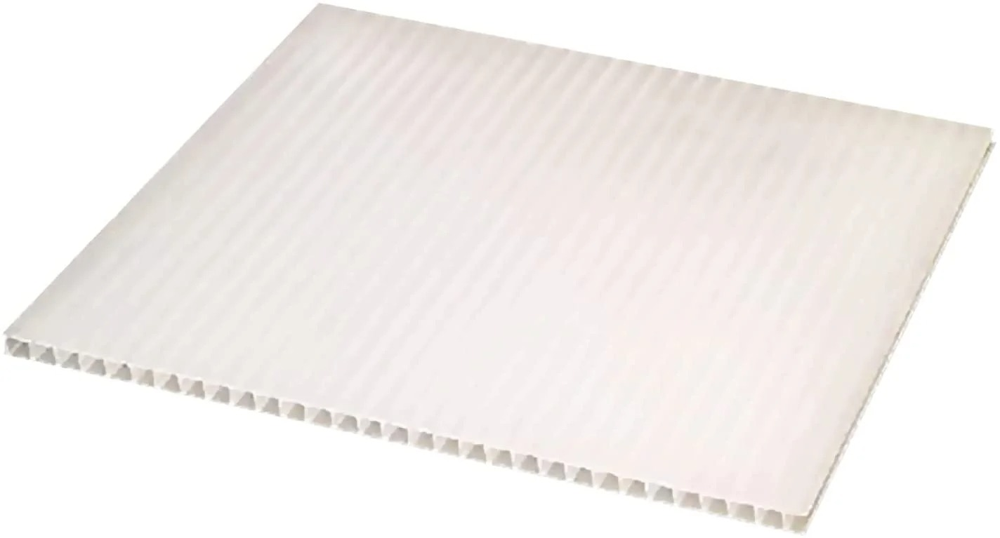
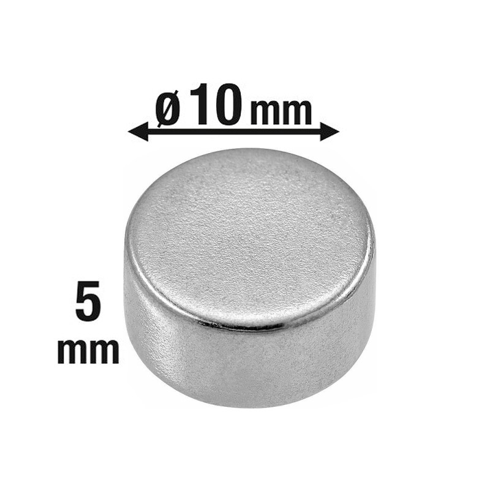

# Piezas impresas en 3D

> Todos los soportes y piezas mecánicas de la impresora están impresos en 3D. Esto permite adaptar cada pieza exactamente al diseño sin depender de piezas comerciales difíciles de encontrar.

---

## Materiales de impresión

| Material | Color | Uso |
|---------|-------|-----|
| PETG | Verde | Piezas estructurales no críticas (escuadras, soportes, protectores de barra, topes) |
| ASA / ABS | Gris | Piezas críticas que requieren mayor resistencia (guías de husillo, portacables funcionales) |

---

## Catálogo de piezas

### Soportes de motor NEMA 23 — ×4

Grandes soportes verdes que alojan los motores NEMA 23 de los ejes X e Y. Tienen espacio para el motor, el acoplador y la correa GT2.

*Cuatro soportes para los motores NEMA 23 de los ejes X e Y.*

---

### Conectores de perfil de aluminio

Conectores metálicos que unen los perfiles de aluminio item 40×80mm entre sí y anclan las guías lineales (ejes X/Y y Z) al marco. No son piezas impresas — son conectores comerciales de acero/aluminio.

*Diagrama de montaje: la tuerca deslizante entra en la ranura del perfil 2040 y el tornillo la aprieta desde dentro.*

*Conector angular metálico para unir dos perfiles de aluminio en ángulo recto.*

*Soportes de correa GT2 y tensores.*

---

### Guías y soportes de husillo (grises)

Piezas grises que sujetan el husillo trapezoidal M12 y lo mantienen alineado con el marco.

*Sujetadores de husillo, engranajes de calibración y soporte de endstop.*

---

### Soportes de motor para el eje correa (tensores)

Piezas verdes con ranuras para ajustar la tensión de la correa GT2 de los ejes X e Y.

*Soporte de motor con polea metálica montado sobre el perfil de aluminio.*

---

### Portacables y organizadores

Piezas grises pequeñas que guían los cables por el marco y los mantienen ordenados.

---

## Todas las piezas en el aula

*Vista completa de todas las piezas impresas antes del montaje. Las verdes son estructurales, las grises son auxiliares.*

*Vista más amplia: toda la gama de piezas extendida en la mesa del aula — soportes de motor, portacables, tensores de correa y guías.*

*Los cuatro soportes de motor NEMA 23 (verde) alineados. El diseño en U permite alojar el motor, el acoplador y la parte superior del husillo.*

*Tensores de correa GT2 verdes, portacables grises y soporte de motor. Al fondo se ve la correa GT2.*

*Piezas auxiliares grises: portacables, engranajes de calibración y soporte de sensor de filamento montado.*

*Tensores de correa GT2 (verde), soporte de endstop (gris), y la correa GT2 de 6mm de paso 2mm. También se ven los soportes de ventilador y el carril guía.*

---

## Render del sistema de tensado de correas

*Renderizado 3D del sistema de tensado de correas GT2 de los ejes X e Y, mostrando el mecanismo de ajuste de tensión.*

---

## Patas niveladoras con bloqueo

La estructura descansa sobre **4 ruedas niveladoras** con bloqueo. Permiten mover la impresora fácilmente y fijarla cuando está en posición.

*Rueda niveladora con mecanismo de bloqueo. El botón naranja baja un apoyo metálico que levanta la rueda del suelo, inmovilizando la máquina.*

---

## Mejoras futuras planificadas

### Cierre con paneles de policarbonato

Para poder imprimir materiales técnicos (ABS, ASA, TPU) que necesitan temperatura ambiente estable, se planea cerrar la máquina con paneles de policarbonato corrugado fijados con **imanes de neodimio**.

*Panel corrugado de policarbonato — ligero, resistente y fácil de cortar a medida.*

*Imán de neodimio ø10×5mm — embutido en las piezas impresas para retener los paneles sin tornillos.*

Los paneles se fijan sin tornillos: los imanes van embutidos en piezas impresas del marco y en el borde del panel, permitiendo abrirlos y cerrarlos rápidamente.

---

## Archivos 3D

> **Pendiente**: Subir los archivos fuente de los modelos 3D (.stl / .step) al repositorio.  
> Los modelos están diseñados específicamente para esta impresora. Contactar con el equipo del proyecto para obtener los archivos.
