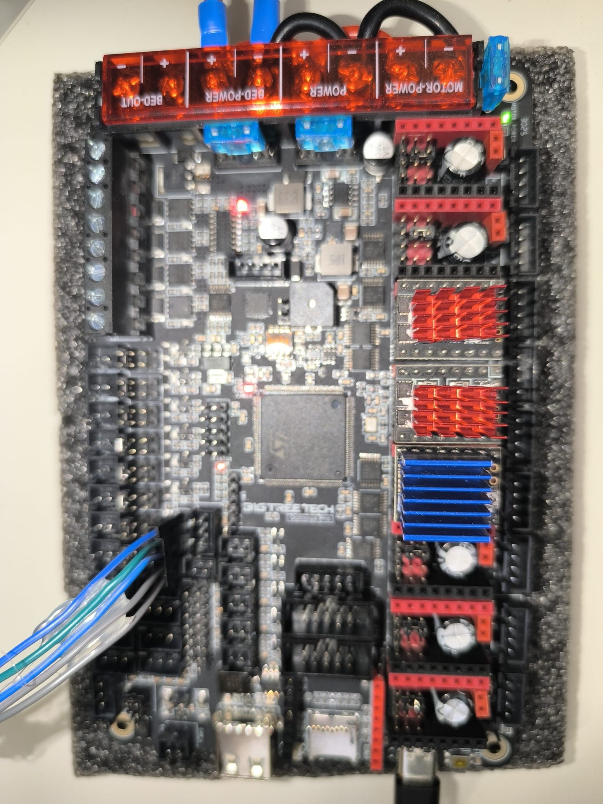
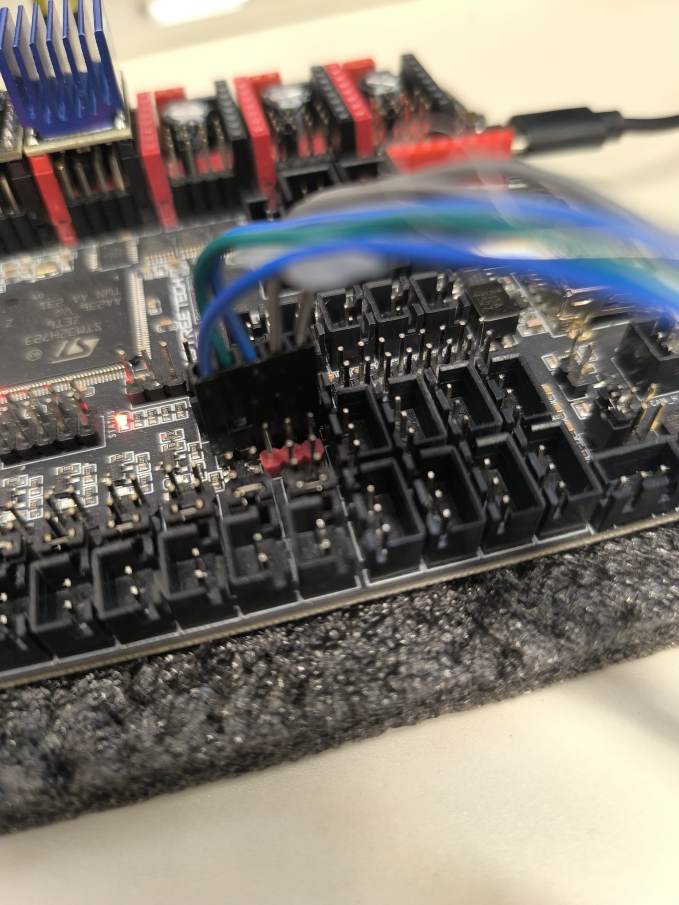

# BTT Octopus Pro V1.1 — Guía de configuración

> Placa base del proyecto. Controla todos los motores, sensores, calefactores y ventiladores.

---

## Vista general


*Vista superior de la Octopus Pro V1.1 sin cables: se ven todos los slots de driver, los conectores de alimentación (MOTOR-POWER, POWER, BED-POWER) y los terminales de motor.*


*Octopus Pro V1.1 con los 8 slots de driver ocupados: TMC5160 (rojos) para Z, TMC2209 (azules) para X, Y y extrusor.*


*Closeup del microcontrolador STM32H723 y los conectores JST de motor. Se puede leer claramente el chip "STM32H723ZET6" de ST Microelectronics.*

---

## Especificaciones

| Campo | Valor |
|-------|-------|
| **MCU** | STM32H723ZET6 (ARM Cortex-M7 @ 550MHz) |
| **Slots de driver** | 8 (MOTOR 0 → MOTOR 7) |
| **Hotend heaters** | 4 (HE0–HE3) |
| **Cama** | 1 salida dedicada (BED-OUT) |
| **Ventiladores** | 6 PWM + 2 siempre-on |
| **Termistores** | 4 (T0–T3) + 2 PT100/PT1000 |
| **Endstops** | 6 + soporta sensores virtuales |
| **Firmware** | Klipper, Marlin, RRF |
| **Conexión CB1** | USB-C (montaje directo o cable) |

---

## Slots de driver — Asignación en nuestro proyecto


*Vista de los 8 slots con drivers instalados y cables de motor conectados. Los rojos son TMC5160 (Z), los azules son TMC2209.*

| Slot | Componente | Driver | Estado |
|------|-----------|--------|--------|
| MOTOR 0 | Eje X | TMC2209 azul | ✅ Activo |
| MOTOR 1 | Eje Z izquierdo | TMC5160 rojo | ✅ Activo |
| MOTOR 2_1 | Eje Y (dual paralelo) | TMC2209 azul | ✅ Activo |
| MOTOR 2_2 | Motor Y derecho (paralelo físico) | — | ✅ Activo |
| MOTOR 3 | — | — | ❌ **DEFECTUOSO** |
| MOTOR 4 | Extrusor SO3 | TMC2209 azul | ✅ Activo |
| MOTOR 5 | Eje Z derecho | TMC5160 rojo | ✅ Activo |
| MOTOR 6-7 | Libres | — | — |

---

## Protocolo de drivers: UART vs SPI

La placa soporta ambos protocolos simultáneamente:

### UART (TMC2209)
- 1 solo cable de datos por driver
- Configuración más simple
- Máx. ~1.5A continuo

```ini
# Ejemplo UART (eje X)
[tmc2209 stepper_x]
uart_pin: PC4    # Pin UART único por driver
```

### SPI (TMC5160)
- 4 cables compartidos (MISO/MOSI/SCK) + 1 Chip Select por driver
- Mayor corriente posible (hasta 3A RMS)
- Telemetría más detallada

```ini
# Ejemplo SPI (eje Z)
[tmc5160 stepper_z]
cs_pin: PD11                    # Chip Select único
spi_software_miso_pin: PA6      # Compartido entre todos los TMC5160
spi_software_mosi_pin: PA7
spi_software_sclk_pin: PA5
```

---

## Jumpers de voltaje — Configuración crítica

La Octopus Pro tiene jumpers para configurar el voltaje de cada slot de driver. Para TMC5160 es **obligatorio** ponerlos correctamente:

- **TMC5160:** Jumper en posición `VFused` (voltaje de motor, no 5V)
- **TMC2209:** Jumper en posición `VFused` también

> Error frecuente: Jumper mal puesto en un slot con TMC5160 → el driver no recibe suficiente tensión → el motor no se mueve o se mueve erráticamente.

---

## Alimentación

La placa tiene **tres entradas de alimentación independientes**:

```
┌─────────────────────────────────────────────────────┐
│  MOTOR-POWER ────── 24V/12-60V para todos los drives  │
│  POWER       ────── 24V para lógica y calefactores    │
│  BED-POWER   ────── 24V para la cama calefactada      │
└─────────────────────────────────────────────────────┘
```

Mantener BED-POWER separado es importante: la cama consume mucha corriente y puede introducir ruido en las señales de paso si comparte el rail con los motores.

---

## Conectores de temperatura (T0–T3)

Los conectores T de la placa sirven primariamente para termistores, pero son entradas digitales de 2 pines. En nuestro proyecto:

| Conector | Uso normal | Nuestro uso |
|---------|-----------|-------------|
| T0 (PF4) | Termistor hotend | Termistor ATC Semitec SO3 |
| T1 (PF3) | Termistor cama | Termistor cama (pendiente) |
| T2 | Libre | — |
| T3 (PF7) | Libre | Endstop Z máximo de seguridad |

---

## Conexión con CB1

El BTT CB1 monta directamente sobre la Octopus Pro (interfaz M.2 o similar). La comunicación se hace por USB-C. Klipper en el CB1 habla con el firmware en el STM32 de la Octopus Pro por ese canal.

Para identificar el puerto serie correcto:
```bash
ls /dev/serial/by-id/
# Resultado: usb-Klipper_stm32h723xx_15000F001051313531383332-if00
```

Este ID se usa en `printer.cfg`:
```ini
[mcu]
serial: /dev/serial/by-id/usb-Klipper_stm32h723xx_15000F001051313531383332-if00
```

---

## Recursos oficiales

- [Repositorio GitHub BTT Octopus Pro](https://github.com/bigtreetech/BIGTREETECH-OCTOPUS-Pro)
- [Manual PDF oficial BTT](https://github.com/bigtreetech/BIGTREETECH-OCTOPUS-Pro/blob/master/BIGTREETECH%20Octopus%20Pro%20V1.0%20user%20manual.pdf)
- [Guía de referencia 3DPrinters-Guide](https://3dprinters-guide.com/bigtreetech-octopus-pro-v1-1-h723-review-a-deep-dive-into-high-speed-3d-printing/)
